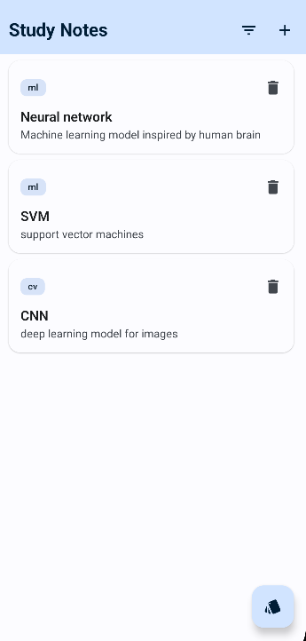
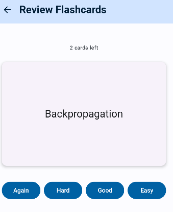
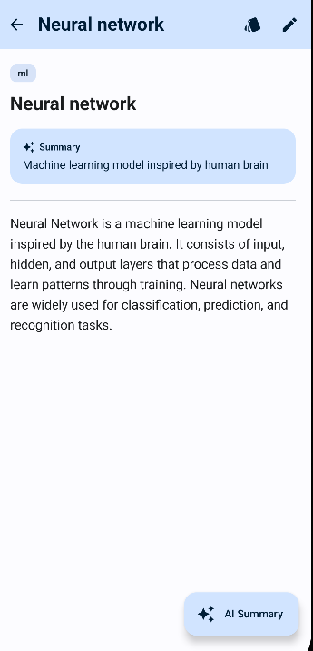

# StudyPlan — Android notes & spaced-repetition flashcard app

[](https://github.com/alexandra-udristoiu/study-plan/actions/workflows/ci.yml)

Android study app for taking notes and reviewing them as
flashcards with spaced repetition, so you revisit each card right before you'd
forget it.

## Features

- **Notes** organised by topic — create, edit, filter, and browse.
- **Flashcards** generated from a note and reviewed in focused sessions.
- **AI flashcard generation** *(requires the companion backend)* — auto-generate
  flashcards from a note's title, summary, and content.
- **PDF text import** *(requires the companion backend)* — pick a PDF and pull its
  extracted text straight into a note's content.
- **Spaced repetition (SM-2)** — cards are scheduled with the SuperMemo-2
  algorithm: easy cards reappear less often, hard ones come back sooner.
- **AI summaries** *(optional, requires the companion backend)* — summarise a
  note and accept or discard the result.
- **Offline-first** — notes and schedules are stored on-device with Room.

## Screenshots

| Notes | Flashcard | Study note |
|:-----:|:---------:|:----------:|
|  |  |  |

## Tech stack

Kotlin · Jetpack Compose · Material 3 · Navigation-Compose · Coroutines · Room (KSP)
· Retrofit/OkHttp · MVVM + repository pattern

## Architecture

```
ui/        Compose screens + ViewModels
domain/    Business logic — spaced-repetition scheduling, summarisation
data/      Repositories, Room entities/DAOs, remote API
```

Scheduling is decoupled from any one algorithm: `CardSchedule` defines when a card
is due, `Sm2CardSchedule` implements SuperMemo-2, and a `CardScheduleFactory`
rebuilds it from a stored payload. Each card persists an opaque state payload plus
a promoted `due` date — so "which cards are due today?" stays a simple query while
the algorithm can change without a database migration.

## Build & run

Requires Android Studio (recent stable) and a device/emulator on **API 26+**.

```bash
git clone <your-repo-url>
cd StudyPlan
./gradlew installDebug   # or open in Android Studio and Run
```

The AI and PDF features call a small companion backend (`/api/summarize`,
`/api/generate-flashcard`, `/api/extract-pdf`). Without it, the rest of the app —
notes, manual flashcards, and spaced-repetition review — works fully offline.

## Roadmap

The app is offline-first today. The next phase grows it into a multi-device,
account-based experience backed by the companion server.

- [ ] **User accounts** — sign-in so notes, flashcards, and review schedules belong
  to a user rather than a single device.
- [ ] **Cross-device synchronisation** — sync each account's notes and
  spaced-repetition state through the backend, so review progress follows the user
  from one device to another. Stays offline-first: local Room remains the source of
  truth and reconciles with the server on reconnect.
- [ ] **Deploy the companion backend** — host the summarisation, flashcard-generation,
  PDF, and new account/sync endpoints instead of running them on localhost.
- [ ] **Broaden test coverage** — extend ViewModel and repository unit tests and add
  Compose UI tests (starting with the review flow) as the app grows.
- [ ] Migrate manual DI to Hilt.
